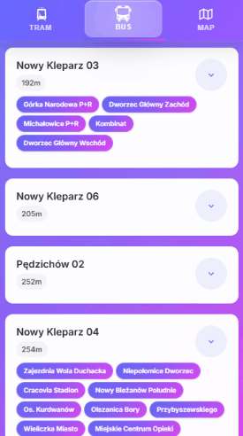
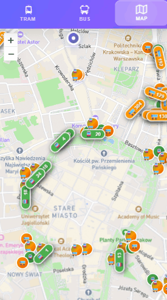

# Kraków Public Transport Live Departures 🚌🚊

A Progressive Web Application (PWA) that displays real-time public transportation in Kraków using GTFS (General Transit Feed Specification) data. Track buses and trams live on an interactive map with departure times and vehicle information.

## 🌐 Live Demo

**Try the app: [https://live-departures.pages.dev/](https://live-departures.pages.dev/)**

  
  &nbsp;
  &nbsp;
  &nbsp;
  &nbsp;
  &nbsp;
  &nbsp;
  

## 🌟 Features

- **Real-time vehicle tracking** - Live positions of buses and trams
- **Interactive map** - Powered by Leaflet with custom vehicle icons
- **Stop information** - Detailed departure times and route information
- **Progressive Web App** - Install on mobile devices for native-like experience
- **Vehicle photos** - Visual identification of different vehicle types

## 🌐 Related Projects

- **Backend**: [live-departures-backend](https://github.com/lukasznidecki/live-departures-backend)
- **Infrastructure**: [live-departures-infra](https://github.com/lukasznidecki/live-departures-infra)

## 🚀 Getting Started

### Development server
Run `ng serve` for a dev server. Navigate to `http://localhost:4200/`. The application will automatically reload if you change any of the source files.

### Build
Run `ng build` to build the project. The build artifacts will be stored in the `dist/` directory.

### Testing
- Run `cypress:run` for end-to-end tests

## 🛠 Technology Stack

- **Angular 19** - Frontend framework
- **Leaflet** - Interactive maps
- **Service Worker** - PWA functionality
- **TypeScript** - Type-safe development
- **Cypress** - End-to-end testing

## 📱 PWA Features

- Offline capability
- Install prompt for mobile devices
- App-like experience
- Responsive design

---

*Built with Angular CLI version 19.2.19*
